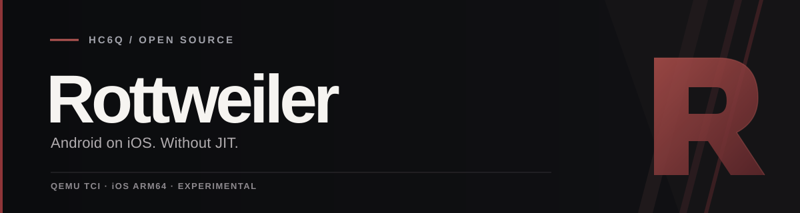

<p align="center">
  
</p>

<p align="center">
  <strong>An experimental Android APK launcher for iOS — powered by QEMU TCI.</strong>
</p>

<p align="center">
  <a href="https://github.com/hc6q/Husk/actions/workflows/nojit.yml?query=branch%3Afeat%2Fnojit"></a>
  
  
  
</p>

<p align="center">
  <a href="#the-project">About</a> ·
  <a href="#current-status">Status</a> ·
  <a href="#try-rottweiler">Install</a> ·
  <a href="docs/nojit.md">Technical documentation</a> ·
  <a href="https://github.com/Leviidev/Husk">Original Husk</a>
</p>

## The project

**Rottweiler** is the No-JIT variant of [Husk, created by Leviidev](https://github.com/Leviidev/Husk). Its goal is to import and run small Android APKs on an iPhone through ordinary sideloading, without enabling JIT, attaching a debugger, using StikJIT/StikDebug, or pairing for JIT.

The first milestone is deliberately small:

**iPhone → Rottweiler → import APK → start Android → install APK → open and interact with a simple app.**

Start with offline Java/Kotlin apps that do not require Google Play Services. Heavy games are outside the initial validation scope.

> [!IMPORTANT]
> **This milestone has not yet been achieved.** Rottweiler is an experimental build for testing and development. A successful CI build does not certify a working Android app on an iPhone.

## What changes in this fork?

Rottweiler keeps Husk's Android VM, LineageOS v12 image, QCOW2 disks, APK bridge, display, USB input and audio infrastructure. The CPU executes QEMU TCI bytecode instead of dynamically generated native code.

| Component | Rottweiler No-JIT |
| :--- | :--- |
| CPU backend | Exact **UTM QEMU 10.0.12-utm**, standard TCG Interpreter / TCI |
| Build selection | `HUSK_NO_JIT=1` |
| Translation buffer | Read/write bytecode; no executable JIT buffer |
| Android | Existing Husk LineageOS v12 image and snapshot infrastructure |
| Graphics | Existing VM ANGLE/Metal path retained; software display available |
| APK import | Existing guest bridge with framing, staging and readiness fixes |
| App identity | **Rottweiler**, bundle identifier `com.husk.nojit` |
| Original Husk target | Available with `HUSK_NO_JIT=0` |

Only the CPU backend uses interpretation. The GPU path is retained, although the shipped software snapshot requires **CPU** renderer selection. GPU mode has a different VM configuration and uses cold boot when the snapshot is incompatible.

The repository remains **`hc6q/Husk`**. Rottweiler is the fork's user-facing name. Internal identifiers and storage keys remain stable to preserve existing Android downloads, settings and imported APKs during upgrades.

## Current status

| Check | Result |
| :--- | :--- |
| iOS arm64 IPA builds | Confirmed in GitHub Actions |
| TCI selected; JIT source objects excluded | Confirmed by build and bundle audits |
| Memory permissions | TCI buffer is RW; runtime audits found no W+X at sampled stages |
| iPhone snapshot restoration | Confirmed from user-provided logs and screenshots |
| Android boot property through the iPhone bridge | Confirmed after restoring the snapshot |
| APK installation and Activity resume | Confirmed in some Linux host experiments |
| Usable APK on an iPhone | **Not confirmed** |
| Touch counter changing from 0 to 1 | **Not confirmed** |
| Audio | **Not confirmed** |

Bluetooth crash dialogs, System UI failures and slow guest responses still block acceptance. A fix moves Bluetooth shell commands off the iOS main actor to address the unresponsive import interface; it still needs build and physical validation.

“Android boot completed” after loading a snapshot proves restored guest readiness, not a successful cold boot. Low-performance guest settings and alternate backends remain separate experiments; failed trials are documented and are not silently included in the IPA.

See [the validation record](docs/nojit.md) for exact commits, artifact hashes, test reports and limitations.

## Try Rottweiler

1. Open the [No-JIT builds on `feat/nojit`](https://github.com/hc6q/Husk/actions/workflows/nojit.yml?query=branch%3Afeat%2Fnojit) and choose a **successful** run.
2. Download the **Rottweiler** artifact and extract `Rottweiler.ipa`. Download and extract **NoJITSmoke-APK** for the small offline test app.
3. Sign and install the unsigned IPA with your usual sideload method. Embedded dylibs must also be signed. Developer Mode may be required by your signing method.
4. Open Rottweiler and download the Android image through the existing setup flow.
5. For the shipped snapshot, select **CPU** renderer, enable snapshot and disable **Sound**.
6. Import the extracted **`.apk`**, wait for installation, then launch **NoJITSmoke**.
7. Check that the app is visible and that **Count touch** changes the counter from **0 to 1**.

> [!NOTE]
> The intended installation path is ordinary sideloading on iOS arm64, without TrollStore or jailbreak. The complete APK workflow still needs physical verification. TCI is substantially slower than JIT, and the snapshot's 4 GB guest memory can exceed a device's process memory budget.

Sound changes VM hardware and snapshot compatibility. Validate it separately after the basic APK and touch test succeeds.

## Build from source

Use macOS arm64 with Xcode and Command Line Tools:

```sh
brew install meson ninja pkg-config xcodegen qemu autoconf automake libtool
python3 -m venv build/ci-python
. build/ci-python/bin/activate
pip install PyYAML

HUSK_NO_JIT=1 ./scripts/ci_build.sh "$PWD/build/Rottweiler.ipa"
```

The [workflow](.github/workflows/nojit.yml) runs target-isolation and bridge-framing checks, builds the IPA and audits the backend before publishing it. Separate build directories prevent an old JIT library from entering the No-JIT package.

[Build details and reproducible tests →](docs/nojit.md)

## Contributing

Useful contributions include small offline APK test cases, reproducible crash reports, guest boot fixes and input/bridge improvements.

For a report, include the IPA commit, iPhone model, iOS version, renderer, snapshot/sound settings, APK package and the step that failed. Attach a relevant log excerpt after removing device UUIDs, private paths and personal data. State whether the app was actually visible and whether its touch counter changed.

Keep the existing architecture and the original JIT target. No-JIT changes must preserve `HUSK_NO_JIT`, genuine TCI execution and the absence of dynamic native code, W+X mappings, BreakpointJIT and JIT pairing flows.

## Credits and licence

Rottweiler is maintained as a fork by [hc6q](https://github.com/hc6q). **Husk and its architecture are the work of [Leviidev and upstream contributors](https://github.com/Leviidev/Husk).** QEMU, UTM, Android, LineageOS, ANGLE and other dependencies retain their respective authorship and licences.

The original JIT target keeps its original requirements. Rottweiler does not claim authorship of upstream work.

This derivative inherits **GPL-2.0-or-later** from Husk. See [licensing documentation](docs/01-licensing.md) and the bundled notices for component-specific terms. Source changes for this fork are available in [`feat/nojit`](https://github.com/hc6q/Husk/tree/feat/nojit).
