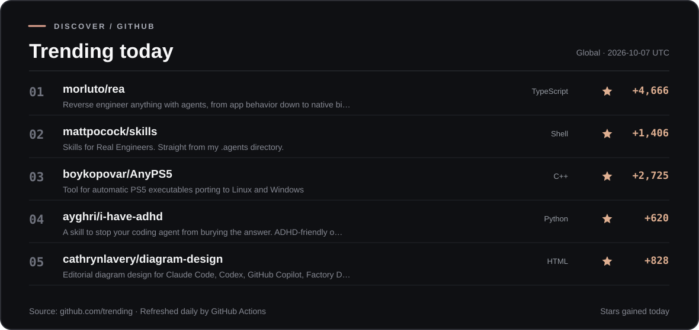

<h1 align="center">Rottweiler</h1>

<p align="center">
  <a href="https://github.com/trending?since=daily">
    
  </a>
</p>
<p align="center"><sub><a href="https://github.com/trending?since=daily">Explore all trending repositories</a> · Updated daily using GitHub Actions</sub></p>

<p align="center">
  <strong>An experimental way to run Android APKs on iOS without enabling JIT.</strong><br>
  Built on <a href="https://github.com/Leviidev/Husk">Husk</a> and the QEMU TCG interpreter (TCI).
</p>

<p align="center">
  <a href="https://github.com/hc6q/Rottweiler/actions/workflows/nojit.yml?query=branch%3Amain"></a>
  
  
  
  <a href="LICENSE"></a>
</p>

<p align="center">
  <a href="#overview">Overview</a> &nbsp;·&nbsp;
  <a href="#project-status">Status</a> &nbsp;·&nbsp;
  <a href="#try-a-build">Try a build</a> &nbsp;·&nbsp;
  <a href="#build-from-source">Build</a> &nbsp;·&nbsp;
  <a href="#documentation">Docs</a> &nbsp;·&nbsp;
  <a href="#contributing">Contribute</a>
</p>

---

## Overview

**Rottweiler** is a No-JIT variant of [Husk](https://github.com/Leviidev/Husk), an Android emulator project for iOS. Instead of generating executable machine code at runtime, its experimental CPU backend interprets QEMU TCI bytecode. The goal is to import and interact with **small, offline Android APKs on an iPhone** using ordinary sideloading — without a debugger, JIT pairing or a jailbreak.

This is a development project, **not a general-purpose Android app runner**. Android boot and APK execution are still being validated, and interpreting instructions is significantly slower than JIT.

> [!IMPORTANT]
> **End-to-end APK use on a physical iPhone has not been confirmed.** A successful IPA build, restored Android screen, or resumed Activity does not prove an app can be used. See the [validation record](docs/nojit.md) before reporting success or compatibility.

### How it differs

| | Rottweiler No-JIT |
| --- | --- |
| CPU execution | QEMU 10.0.12-utm, interpreted with TCI |
| No-JIT build flag | `HUSK_NO_JIT=1` |
| Android guest | Existing Husk LineageOS v12 image |
| Graphics | Existing display path; CPU renderer recommended for the shipped snapshot |
| APK handling | Existing Husk guest bridge and installer |
| iOS target | arm64; project deployment target iOS 16.4 |
| Original Husk build | Kept separately with `HUSK_NO_JIT=0` |

Internal `Husk` directory names, settings keys and the `com.husk.nojit` bundle identifier are intentionally retained for compatibility. The application and repository are presented as **Rottweiler**.

## Project status

These are separate validation steps, not a single “working” badge.

| Milestone | Evidence |
| --- | --- |
| Build an iOS arm64 IPA | **Confirmed in CI** |
| Compile the interpreter and exclude JIT code | **Confirmed by build audits** |
| Restore the guest image and observe Android on iPhone | **Observed in device logs/screenshots** |
| Install and resume a small APK on a Linux test host | **Observed, with UI limitations** |
| Use an APK interactively on iPhone | **Not confirmed** |
| Verify that a touch changes the test app's counter | **Not confirmed** |
| Confirm usable guest audio | **Not confirmed** |

Bluetooth crash dialogs, System UI stalls and slow responses remain known blockers. A restored snapshot is not proof of a successful cold boot. Detailed test reports, timings and failures are preserved in [docs/nojit.md](docs/nojit.md).

## Try a build

1. Open the [Rottweiler No-JIT workflow](https://github.com/hc6q/Rottweiler/actions/workflows/nojit.yml?query=branch%3Amain) and select a successful run from `main`.
2. From **Artifacts**, obtain `Rottweiler` (the unsigned `Rottweiler.ipa`) and `NoJITSmoke-APK` (the offline test app). Artifacts are only present when the relevant jobs succeed and may expire.
3. Sign the IPA and its embedded libraries using your usual iOS sideloading method. Developer Mode may be necessary, depending on the signing method.
4. Open Rottweiler and complete the Android image setup.
5. For the supplied snapshot, select the **CPU renderer**, keep **snapshot loading enabled**, and turn **Sound off**.
6. Import `NoJITSmoke.apk`, attempt to install and launch it, then check whether **Count touch** changes its counter from 0 to 1.

This is a **test procedure**, not a promise the workflow will succeed on your device. Ordinary sideloading is the intended route; a JIT enabler or jailbreak is not a prerequisite for the No-JIT target. The Android guest can require substantial storage and memory.

For a reproducible report, follow the [testing guide](docs/TESTING.md).

## Build from source

Requires **macOS arm64**, Xcode and Xcode Command Line Tools.

```sh
brew install meson ninja pkg-config xcodegen qemu autoconf automake libtool
python3 -m venv build/ci-python
. build/ci-python/bin/activate
pip install PyYAML

HUSK_NO_JIT=1 ./scripts/ci_build.sh "$PWD/build/Rottweiler.ipa"
```

The No-JIT workflow performs target-isolation checks, a guest shell framing test, an iOS IPA build and a separate offline test APK build. An IPA created locally is **not automatically signed** for installation.

## Documentation

| Resource | Contents |
| --- | --- |
| [Validation log](docs/nojit.md) | Test evidence, limitations, failure modes and historical experiments |
| [Architecture](docs/00-architecture.md) | Overview of the VM and guest components |
| [Testing guide](docs/TESTING.md) | How to reproduce and report a physical-device test |
| [Contributing](CONTRIBUTING.md) | Development workflow and contribution requirements |
| [Licensing](docs/01-licensing.md) | GPL and third-party components |

<details>
<summary><strong>Repository layout</strong></summary>

| Path | Purpose |
| --- | --- |
| `src/app/` | iOS application and Xcode project |
| `src/ios-jit/` | Original Husk guest integration |
| `src/translation-layer*/` | Existing experimental translation components |
| `scripts/` | Source acquisition, build, packaging and verification |
| `tests/nojit/` | No-JIT checks, fixtures and test evidence |
| `patches/` | QEMU and dependency patches |
| `docs/` | Architecture, licensing and engineering notes |
| `.github/workflows/` | CI workflows and IPA artifacts |

</details>

## Contributing

Useful contributions include reproductions of guest boot problems, APK installation or input bugs, small offline test APKs, and improvements to build reproducibility. Please read [CONTRIBUTING.md](CONTRIBUTING.md) and use a [bug report](https://github.com/hc6q/Rottweiler/issues/new?template=bug_report.yml) when something fails.

The No-JIT target must remain genuinely interpreted: no dynamically executable JIT buffers, debugger dependency or hidden JIT pairing requirement. Do not publish personal device identifiers, signing credentials or proprietary APKs in issues.

## Credits & license

Rottweiler is maintained by [hc6q](https://github.com/hc6q), based on **[Husk by Leviidev and its contributors](https://github.com/Leviidev/Husk)**. The original architecture and upstream contributions remain credited to their respective authors. QEMU, UTM, Android, LineageOS, ANGLE and other dependencies retain their own licenses.

The project source is distributed under **GPL-2.0-or-later**; see [LICENSE](LICENSE) and [third-party licensing notes](docs/01-licensing.md). This fork does not claim authorship of the original Husk implementation.
